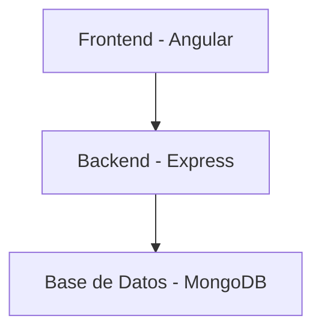

# Documentación Gerencial del Proyecto TecnoShop

## Tabla de Contenidos

- Introducción
- Descripción del Problema
- Análisis de Necesidades
- Solución Propuesta
- Diagrama de Arquitectura del Sistema
- Flujo de Datos
- Estimación de Impacto
- Análisis de Viabilidad Técnica y Económica
- Tecnología Utilizada
- Presentación
- Conclusión

## Introducción

El proyecto TecnoShop es una solución de automatización empresarial diseñada para optimizar la gestión de pedidos y logística de la empresa ficticia "TecnoShop". Este documento proporciona una guía de uso y justificación del proyecto, estableciendo el alcance, objetivos, requisitos y otros aspectos relevantes.

## Descripción del Problema

La empresa "TecnoShop" realiza la gestión manual de sus pedidos y logística, lo que genera varios problemas, tales como:

- Retrasos en el procesamiento de pedidos.
- Errores humanos en la entrada y gestión de datos.
- Falta de visibilidad en tiempo real del estado de los pedidos y del inventario.
- Dificultad para generar reportes gerenciales precisos y oportunos.

## Análisis de Necesidades

Para resolver los problemas mencionados, se identificaron las siguientes necesidades:

1. **Automatización de la entrada de pedidos**: Un sistema que permita a los usuarios ingresar pedidos de manera rápida y precisa mediante un formulario web con validaciones.
2. **Gestión centralizada de inventarios**: Un módulo que permita gestionar el inventario de manera eficiente, con actualizaciones en tiempo real.
3. **Generación de reportes automatizados**: Un sistema que genere reportes mensuales de pedidos y productos más vendidos para la gerencia.
4. **Notificaciones automáticas**: Un sistema que envíe alertas cuando el inventario esté bajo, asegurando una rotación de inventario de 30 días.

## Solución Propuesta

La solución propuesta es un sistema integrado que consta de los siguientes módulos principales:

1. **Automatización de la entrada de pedidos**: Un formulario web con validaciones que permite a los usuarios ingresar pedidos de manera rápida y precisa.
2. **Gestión centralizada de inventarios**: Un módulo que permite gestionar el inventario de manera eficiente, con actualizaciones en tiempo real.
3. **Generación de reportes automatizados**: Un sistema que genera reportes mensuales de pedidos y productos más vendidos para la gerencia.
4. **Notificaciones automáticas**: Un sistema que envía alertas cuando el inventario esté bajo, asegurando una rotación de inventario de 30 días.

## Diagrama de Arquitectura del Sistema

## Flujo de Datos

1. **Entrada de Pedidos**: Los usuarios ingresan pedidos a través del formulario web en el frontend.
2. **Procesamiento de Pedidos**: El backend recibe los datos del pedido, los valida y los almacena en la base de datos.
3. **Actualización de Inventario**: El backend actualiza el inventario en la base de datos en tiempo real.
4. **Generación de Reportes**: El backend genera reportes mensuales y los envía a la gerencia.
5. **Notificaciones Automáticas**: El backend envía alertas cuando el inventario está bajo.

## Estimación de Impacto

La implementación de este sistema tendrá los siguientes impactos positivos:

- **Ahorro de Tiempo**: La automatización de la entrada de pedidos y la gestión de inventarios reducirá significativamente el tiempo necesario para procesar pedidos.
- **Reducción de Errores**: La validación automática de datos reducirá los errores humanos en la entrada y gestión de datos.
- **Visibilidad en Tiempo Real**: La actualización en tiempo real del inventario y el estado de los pedidos proporcionará una visibilidad completa y actualizada.
- **Reportes Precisos y Oportunos**: La generación automática de reportes permitirá a la gerencia tomar decisiones informadas y oportunas.

## Análisis de Viabilidad Técnica y Económica

### Viabilidad Técnica

- **Lenguaje de Programación**: Angular para el frontend, Node.js y Express para el backend.
- **Base de Datos**: MongoDB para el almacenamiento de datos.
- **Compatibilidad**: El sistema es compatible con sistemas Windows.

### Viabilidad Económica

- **Costos de Desarrollo**: Los costos de desarrollo incluyen el tiempo de los desarrolladores y los recursos necesarios para implementar el sistema.
- **Costos de Mantenimiento**: Los costos de mantenimiento incluyen la actualización y el soporte continuo del sistema.
- **Beneficios**: Los beneficios incluyen el ahorro de tiempo, la reducción de errores y la mejora en la toma de decisiones.

## Tecnología Utilizada

- **Frontend**: Angular
- **Backend**: Node.js, Express
- **Base de Datos**: MongoDB
- **Otros**: API de Reconocimiento de Voz de Web Speech para la entrada de datos por voz.

## Presentación

### Explicación del Problema

La empresa "TecnoShop" enfrenta problemas de retrasos, errores humanos y falta de visibilidad en tiempo real debido a la gestión manual de pedidos y logística.

### Solución

La solución propuesta es un sistema integrado que automatiza la entrada de pedidos, gestiona el inventario de manera centralizada, genera reportes automatizados y envía notificaciones automáticas.

### Demostración de los Módulos Implementados

1. **Formulario de Pedidos**: Demostración del formulario web para la entrada de pedidos.
2. **Gestión de Inventarios**: Demostración del módulo de gestión de inventarios.
3. **Generación de Reportes**: Demostración de la generación automática de reportes.
4. **Notificaciones Automáticas**: Demostración de las alertas de inventario bajo. 

### Roles

1.  **Administrador**: Tiene acceso a todas las funcionalidades del aplicativo, maneja los recursos y puede visualizar los registros de todos los clientes (A nivel de base de datos está represado por el entero 3).

2. **Empleado**: Tiene acceso limitado a las funcionalidades del aplicativo, tan solo maneja la insersión de pedidos y reportes, también puede visualizar los pedidos de los clientes (A nivel de base de datos está represado por el entero 2). 

3. **Cliente**: Tiene acceso tan solo a la funcionalidad del registro de sus pedidos y sólo puede visualizar pedidos a su nombre (A nivel de base de datos está represado por el entero 1). 

### Dar acceso al auditor

**Leer el Archivo README.md**

### Reflexión sobre las Áreas de Mejora y Lecciones Aprendidas

- **Áreas de Mejora**: Optimización del rendimiento del sistema, mejora de la interfaz de usuario, integración con más APIs externas.
- **Lecciones Aprendidas**: Importancia de la validación de datos, beneficios de la automatización, desafíos de la integración de sistemas.

### Tiempo Estimado

La presentación completa tomará aproximadamente 10 minutos.

## Conclusión

El proyecto TecnoShop proporciona una solución integral para la gestión de pedidos y logística, resolviendo los problemas de retrasos, errores humanos y falta de visibilidad en tiempo real. La implementación de este sistema resultará en un ahorro significativo de tiempo, reducción de errores y mejora en la toma de decisiones gerenciales.